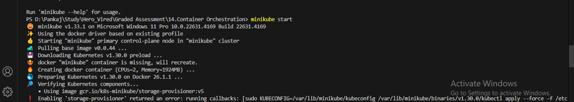
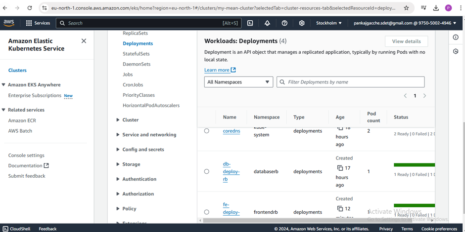

# ResumeAI

## Overview

The project is a MEAN project and uses node version 18.

- Application run locally and tested its ruinning.

- Created docker files for backend and frontend build iot and push to ECR.

- Created pipeline on jenkins server.

- Created jenkins file and push to github repository.

- Run jenkins pipeline.

- Build images via jenkins file and pushed to ECR.

- Deploying mean application using Minikube.

- Login AWS account via cmd.

- Apply .yaml files on minikube cluser and deployed application successfully.

- Now deploying mean application using Eks.

- Apply .yaml files on Eks cluser and deployed application successfully.

- Verified deployment created on Eks cluster.

